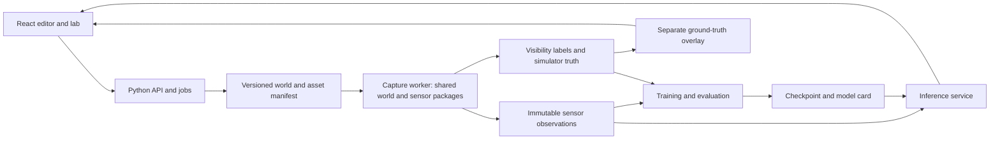

# Sensor-fusion lab architecture

Status: SF-07 first-return LiDAR passed local acceptance; SF-08 is next,
2026-09-23.
Frontend/backend structure,
health/capability API, shared wire contracts and deterministic world generation
exist, with worker streaming and independent sensor-geometry residency.
RGB capture, geometric depth/instance references, raw thermal IR and sparse
first-return LiDAR are implemented; datasets and models remain planned. No unimplemented sensor/training
capability is advertised. Verification is local only by user instruction.
Execution order and acceptance belong to [BACKLOG.md](BACKLOG.md); data semantics
belong to [DATA_CONTRACTS.md](DATA_CONTRACTS.md).

## 1. Outcome and baseline

Build one reproducible world that can be observed by RGB, long-wave thermal IR
(LWIR), and LiDAR, labeled using actual line of sight, used to train a detector,
and replayed under controlled changes to weather, temperature, and time of day.
Preserve the existing editor and volumetric arches, tunnels, and overhangs.

Inspected baseline: `f8879c1bdb7446d682f9a6c7a58f4f08a012806b` on `main`.

| Area | Verified current state | Consequence |
| --- | --- | --- |
| Application | React, TypeScript, Vite, Three.js; root `src/` | Split structure before adding services |
| Terrain | `src/terrain.ts:createTerrain` samples one fixed local volume; samples map approximately to x/z -13..13, y -8..18 | Current scale control changes features inside that volume; increasing it does not produce a connected large map |
| Navigation | `src/TerrainViewport.tsx` orbit distance 16..85, camera far plane 200 | Add world navigation and explicit sensor poses |
| Rendering | Fixed lighting, decorative shadow plane, optional transparent water | Lab sensing must exclude editor helpers and define physical surface policies |
| Export | Current viewport PNG, OBJ, GLB | No synchronized sensor capture or annotation pipeline |
| Model | Only `docs/ESSRF.md` | Architecture proposal, no implementation or checkpoint |
| Verification | `npm run build` and `npx tsc --noEmit` passed on 2026-09-21 | No test script, sensor tests, browser regression baseline, or lab performance results yet |

Development environment observed: Node 25.6.1, npm 11.9.0, Python 3.13.10,
PyTorch 2.13.0+cu130 with CUDA available, NVIDIA RTX 3090 / 24,576 MiB.
These are observations, not a dependency lock or portability guarantee. SF-01
will choose supported toolchain versions and lock an isolated backend environment.

## 2. Decisions and authority

| ID | Decision | Reason / revisit condition |
| --- | --- | --- |
| A01 | React/Three.js frontend; Python API, dataset jobs, PyTorch training and inference | Reuse editor while putting ML and durable jobs in the backend |
| A02 | Shared TypeScript world and sensing packages, callable by a backend-managed capture worker | Keep existing geometry generation and use exactly the same mesh and sensor code in preview and offline capture |
| A03 | Backend owns versioned world descriptions and completed artifacts; the frontend edits requests and displays results | Browser closure must not interrupt an accepted generation job |
| A04 | Pinned headless Chromium/Three.js worker for RGB, IR, and ID/depth passes; BVH ray intersection for LiDAR | Reuse the visual scene without inventing a second geometric world; retain brute-force ray tests as a correctness reference |
| A05 | Single host, local filesystem artifacts, SQLite job metadata initially | Avoid distributed infrastructure until throughput measurements justify it |
| A06 | Independent RGB, IR, and LiDAR sensor poses and intrinsics; a co-located preset for initial tests | Prevent accidental pixel-alignment assumptions while keeping initial fixtures simple |
| A07 | Separate raw observations, training labels, and simulator truth | Inference cannot read object lists, oracle masks, weather truth, or boxes |
| A08 | Implement and measure simple baselines before full temporal ESSRF | Catch generator/label defects and establish whether routing improves accuracy |

A04 passed its initial WebGL2/float-readback capability gate in SF-05, its
depth-tested float LWIR extension in SF-06, and uses mesh/scene BVHs for
SF-07 LiDAR; measured throughput and memory remain
environment-specific and are recorded in the corresponding evidence.
If headless GPU rendering, float readback, or throughput is inadequate, record an
ADR and update this document before replacing the renderer. Replacements must
consume the same canonical assets/world snapshots and pass the same fixtures.
Do not silently substitute software rendering, bounding-box raycasts, or RGB
recoloring for an unavailable modality.

The first implementation uses a synchronous worker protocol: versioned JSON
requests with file references and bounded binary outputs, explicit timeouts,
error codes, and worker capability handshake. The Python coordinator invokes the
Node worker; Node manages the pinned browser. A worker accesses only its assigned
job directory and local asset catalog. No arbitrary shell or URL supplied by UI.

## 3. Target repository and process layout

This is the target layout. SF-01 creates frontend, backend, contracts, tooling
and tests; world/sensor/capture/asset packages are added in their named stages.

```text
frontend/                     React app, editor, lab and prediction views
packages/
  world/                      deterministic fields, chunks, placement, snapshots
  sensors/                    shared calibration and Three.js reference capture
  contracts/                  generated TypeScript contract types
backend/
  app/                        Python API and job coordinator
  datasets/                   validation, splits, training-only loaders
  models/                     unimodal, fusion, ESSRF, losses and evaluation
  tests/                      API, dataset and model tests
workers/capture/              Node + headless Chromium capture process
contracts/                    canonical JSON Schema and OpenAPI artifacts
assets/catalog/               metadata, adapters and source provenance
tools/                        import, validation, benchmarks, local launch
tests/                        world/sensor fixtures and browser workflows
docs/                         architecture, backlog, model and experiment records
artifacts/                    ignored local datasets, runs, caches, checkpoints
```

Keep a root npm workspace and root convenience commands. Use a separate locked
Python environment. Move `src/` into `frontend/src/` without redesigning the UI;
extract world logic in SF-02 rather than mixing that refactor with the move.
Production lab assets are served as files; the current single-file build can
remain an optional legacy-editor export, but cannot contain a dataset or backend.



Training joins observation IDs to labels. Inference accepts only the observation
schema, declared calibration, availability/health, and its own prior state. The
ground-truth overlay is a separate UI layer, never a source of predictions.

## 4. Connected worlds and aerodrome

SF-02R implementation: [connected world profile](WORLD_GENERATOR.md). The shared
package generates the finite domain as independent chunks; the browser shows
a moving, bounded nine-chunk neighborhood, with bookmarks and 16 region shortcuts. The
legacy editor keeps its characterized geometry. Multi-scale relief, bounded
formations, trees and rocks are deterministic world-space fields/placements.
Global marching tetrahedra use consistent face diagonals, field-derived normals
and world-space biome colors; the preview renders their triangles flat-shaded.
Mesh pitches are 4 m and 2 m with equal-pitch boundary tolerance of 0.0001 m.
SF-03 adds worker generation, bounded LRU caches, atomic neighborhood LOD and
independent fixed-pitch sensor residency; see [streaming policy](STREAMING.md).
Mixed-pitch adjacency is deliberately not used: 2 m/4 m detail changes swap the
entire display neighborhood after readiness, preserving equal-pitch seams.
Full-domain numerical acceptance is not an interactive all-chunks-resident
performance claim.

Use metres and an explicit finite world extent. Initial acceptance targets a
connected 2,048 x 2,048 m world with 128 m chunk addressing (16 x 16 chunks),
configurable within measured resource bounds. SF-02 verifies that finite domain
numerically; interactive residency capacity is measured in SF-03. The legacy
26-unit diorama is not stretched to fill the world.

Extract the existing density/noise/meshing path into a deterministic world-space
field. Add a continuous base terrain and biome/feature placement; adapt the
existing preset forms as bounded features. Never tile identical diorama islands.
Global coordinates and shared boundary samples determine chunk seams. Support
negative chunk indices and stable instance IDs independent of load order.

Render a bounded neighborhood with chunk streaming, geometry disposal, and
display LOD. Sensor capture has its own fixed geometry policy: load every chunk
that can occlude a sensor ray within its configured range before capturing.
Do not let camera culling, display LOD, or an unloaded chunk expose hidden objects.
Generate in workers, cancel superseded previews, and retain a memory-bounded cache.

Create an aerodrome as a world feature: graded runway/apron, taxiway, markings,
hangars, control tower, perimeter and service road. An initial 1,200 x 40 m runway
is a simulation layout choice, not an aviation certification or aircraft
operational claim. Preserve grading transitions into terrain; test aircraft
ground contact, clearances, placement overlap, and hangar occlusion. Add a coast
and harbor scenario for ship assets after the aerodrome pipeline works.

Suggested first sensor trajectory: static observation points and repeatable
ground/aerial passes around the aerodrome. Cameras must not spawn inside opaque
geometry. Free orbit is an inspection tool; capture uses a named rig and pose.

## 5. Asset ingestion and heat

SF-04 implementation: [asset adapters, scales and aerodrome](ASSETS_AND_AERODROME.md).
SF-05 implementation: [RGB/reference capture and job semantics](CAPTURE.md).
SF-06 implementation: [surface heat and thermal IR](THERMAL_IR.md).
SF-07 implementation: [first-return LiDAR](LIDAR.md).
Three self-contained GLBs and hash-verified metadata ship in
`frontend/public/catalog/`; `@yulab/assets` builds the same background/object
geometry for display and independent sensor residency. The small initial bundle
is versioned with code; larger later imports/datasets remain external artifacts.

The source directory is `K:\PycharmProjects\world_models\Generated` (external).
The inventory contains 17 project directories:

| Category | Projects |
| --- | --- |
| aircraft (11) | a-10-model, b-52-model, f-14-model, f-16-aircraft, f-16xl-aircraft-3d-model, f-18-3d-model, f-22-model, mirage-2000-model, mq-9-uav-model, rq-4-uav, su-35-3d-model |
| AA (4) | fk-2000-3d-model, modular-air-defence-complex-model, modular-air-defense-simulation, modular-spaa-3d-model |
| ships (2) | guided-missile-cruiser-model, missile-destroyer-model |

These are source projects, not a verified collection of interchange meshes.
Inspected F-16 and RQ-4 components contain procedural Three.js geometry and React
dependencies; RQ-4 also uses React Three Fiber. This does not prove every project
uses the same format. Audit each asset before selecting its adapter.

Import geometry/materials into self-contained GLB plus a versioned physical
metadata sidecar. Preserve source identity/hash, adapter version, scale, axes,
ground/water contact reference, semantic subparts, bounds, and use permissions.
Do not import source applications' cameras, controls, simulation loops, or
projectiles. Freeze animation/pose explicitly for capture; dynamic support comes
later. Never replace an unavailable source model with a generic shape under its
original model name. Record rejected or unsupported imports with reasons.

First integration assets: one F-16, one RQ-4, and one ground vehicle, followed by
the remaining aircraft/ground assets and ships. Detection classes initially are
`aircraft`, `ground_vehicle`, `ship`; model identity remains metadata and a later
fine-grained classification extension. Aerodrome buildings, trees and terrain
are background occluders. Add classes only with class-map versioning.

Implemented thermal metadata describes surfaces, not whole-object class colors:
emissivity, solar absorption, thermal response time, operating state, heat-source
power, and source-to-surface coupling. Engines/exhaust regions can heat locally;
parked/off objects cool toward environmental equilibrium. Infrastructure may
include heated service equipment as distractors. Units and equations are in
[DATA_CONTRACTS.md](DATA_CONTRACTS.md). No real aircraft heat signatures are
claimed; the first material presets are synthetic, documented approximations.

## 6. Sensor and environmental models

RGB uses physical scene geometry, sun/sky lighting, shadows, atmospheric
attenuation, exposure, shot/read noise, blur, and configurable sensor saturation.
Save machine input separately from UI contrast/tone-map controls. Night reduces
available illumination; any compensation through exposure must affect blur/noise.

SF-06 IR uses surface thermal state and emissivity, environmental reflected radiance,
band-integrated emission, path attenuation/emission, and sensor noise/quantization.
Store linear sensor values and calibration, plus an optional colorized preview.
It must work at night without relying on RGB lights. A hot background can reduce
contrast; a hotter engine can remain visible. Thermal images do not see through
opaque walls. Canopy/window transparency is modality-specific; unsupported
transmission must have an explicit opaque approximation recorded in the manifest.
SF-08 adds synthetic atmospheric/path terms and environmental presets.
The implemented response and its explicit time behavior are
specified in [WEATHER.md](WEATHER.md).

LiDAR emits a finite set of beams from its own pose, intersects the first opaque
surface, and applies range/intensity response, receiver noise, detection threshold,
weather attenuation, dropouts and nearer particle returns. V1 is single-return;
the existence of a dropped front-surface return never exposes a rear surface.
Depth-image pixels or sampled object vertices are not LiDAR ground truth.

One environmental state drives all modalities: simulation time, sun geometry,
ambient temperature, fog extinction/visibility, rain rate, snow rate, wind, and
surface wetness. Presets provide controlled clear, night, fog, rain, snow and
thermal-crossover conditions. Band-specific coefficients and noise distributions
are versioned synthetic parameters until calibrated against measurements.

Use a fixed simulation clock and channel-separated seeded random streams. Pause,
capture and replay freeze world state; simultaneous passes cannot advance heat
or weather independently. Start with static synchronized captures, then add scan
timing/motion distortion and temporal sequences. Changing time in the demo must
declare whether it replays a thermally equilibrated preset or advances thermal
history; a clock slider alone must not silently erase engine cooldown.

Expected degradation is evaluated statistically under controlled conditions,
not enforced by hard-coded prediction confidence or a universal monotonic score.
Fog/rain affect RGB and LiDAR differently; IR also has atmospheric limitations.
Do not infer calibrated real-world performance from these synthetic presets.

## 7. Backend and jobs

Implemented consumer operations are listed below. SF-05 adds capture submission,
job polling/cancellation and published-artifact reads; the remaining operations
are not exposed as stubs. Canonical OpenAPI and JSON Schema in `contracts/` precede
provider/client code. TypeScript and Python types are generated from them;
runtime boundary validators enforce the same schema with shared fixtures.

| Operation | Consumer need |
| --- | --- |
| GET `/api/v1/capabilities` | Show renderer, sensor, device and checkpoint availability |
| GET `/api/v1/assets` | Browse imported model metadata and import failures |
| POST `/api/v1/worlds` | Validate/save a reproducible world description |
| POST `/api/v1/captures` | Queue a synchronized capture for world/rig/environment |
| POST `/api/v1/datasets` | Queue a split-aware capture plan and immutable manifest |
| POST `/api/v1/training-runs` | Train against a validated dataset and model config |
| GET `/api/v1/jobs/{id}` | Progress, logs, errors and artifact references |
| POST `/api/v1/jobs/{id}/cancel` | Cooperative cancellation |
| POST `/api/v1/inference` | Predict from an observation bundle and optional state |
| GET `/api/v1/artifacts/{id}` | Fetch an authorized artifact by opaque ID |

Single-host job states: queued, running, cancelling, cancelled, succeeded, failed.
Write into temporary directories, validate all outputs, then atomically publish
a completion manifest. Partial jobs cannot become training datasets. Persist
progress and worker identity; restart recovers or explicitly fails interrupted
jobs. Checkpoint/resume and idempotent capture IDs avoid duplicate frames.

Bind development services to loopback. Validate sizes, numeric ranges, paths,
artifact IDs and request schemas. UI requests cannot name arbitrary local files.
Serialize GPU-heavy training/capture by default to avoid memory contention;
report queue position instead of silently failing or taking unrelated resources.
Keep an explicit stop control and resource/disk ceilings for long jobs.

## 8. Dataset, training and evaluation

Freeze a schema-valid world+asset+sensor+environment snapshot before capture.
Store raw modalities, timestamps/calibration, per-modality visible annotations,
3D object truth, and checksums in separate namespaces. Use compressed binary
arrays for numeric data, PNG where appropriate for RGB, and JSON/JSONL indexes.
LiDAR is a sparse point set with beam/time/intensity information, not just a
rendered picture. A projected range image is a derived visualization.

Split by world/layout seed and trajectory group BEFORE generating variants.
All weather variants, nearby frames and crops of a group stay in the same split.
Report a distinct held-out-asset evaluation where a class has multiple assets;
do not confuse novel poses of the same mesh with novel object geometry.

Initial capture ladder (configurable starting budgets, not sufficiency claims):

| Stage | Capture triples | Purpose |
| --- | ---: | --- |
| Correctness fixtures | At least 24 | Occlusion, projection, heat and noise edge cases |
| Pipeline pilot | 300 | Storage/throughput estimate and loader verification |
| Learning pilot | 3,000 | Initial 70/15/15 grouped train/validation/test split |
| Scale-up | 10,000, then 30,000 if justified | Validation learning curves and condition/class coverage |

Ensure each evaluable class/condition has sufficient independent groups; report
counts and confidence intervals, and mark underrepresented strata unevaluable.
The final required count is selected from validation learning curves, coverage,
measured disk/compute cost, and convergence. The sealed test set is not used to
select data volume, thresholds, model architecture, or hyperparameters.

First train unimodal and simple fusion detectors with shared evaluation, then
the compact ESSRF profile in [ESSRF.md](ESSRF.md). Begin with small batches,
mixed precision where validated, bounded point/query counts, and gradient
accumulation. Starting budget: <=18 GiB peak allocated GPU memory for training
on the observed 24 GiB device; report reserved and total process memory too.
Any reduced resolution/points/query count becomes part of the experiment config.

Measure visible 2D AP/recall, eligible-object 3D AP at declared class IoU
thresholds, localization error, calibration/abstention, subset availability,
condition severity, range and occlusion bins. Report per-class results and
false positives on empty/distractor scenes. Compare models with the same data,
training budget and inference inputs. A converged loss is not proof of a useful
detector. No claim that ESSRF beats baselines until measured on untouched data.

Record source commit, configuration, asset/dataset hashes, split identity, seed,
dependencies/device, runtime, peak memory, learning curves and checkpoint hash.
Require repeat runs and uncertainty estimates for model-comparison claims.
Deterministic replay targets a pinned environment; do not promise bitwise GPU
training reproducibility across drivers or platforms. See the official
[PyTorch reproducibility guidance](https://docs.pytorch.org/docs/stable/notes/randomness.html).

## 9. Demonstration and performance

Lab UI: world/asset placement and rig navigation, side-by-side RGB/IR/LiDAR,
time/weather/temperature/heat controls, capture/export, dataset and training job
progress, checkpoint selection, detection overlays, and condition metrics.
Raw IR scale and point counts remain visible. Explicitly distinguish predictions
from optional truth overlays and distinguish unavailable sensors from empty data.

Use a synchronized capture ID across panes and predictions. Discard late
responses from superseded captures. Moving the inspection camera must not alter
a fixed sensor rig unless the user explicitly selects "use this view as rig".
Support paired replay of the same pose/object state with changed weather.

Initial engineering targets, to validate and revise with measured evidence:
30 fps median interactive world view at 1280 x 720; p95 <=50 ms frame time after
warmup; no monotonic GPU/CPU resource growth over 100 chunk transitions; <=18 GiB
training allocation; <=500 ms p95 batch-one inference at the pilot profile.
Sensor capture throughput is measured in SF-05 before setting dataset completion
estimates. Full-resolution capture may run slower than interactive preview;
the UI must show that rate honestly. Benchmark on the named machine with stated
object counts, mesh detail, resident chunks, resolution and point budget.

SF-03 measured 16.7 ms median / 16.9 ms p95 across the post-warmup production
traversal at 1280 ? 720, nine 4 m chunks, 79,670..106,372 terrain faces on the
RTX 3090 / i5-12400. The targets remain unchanged for this recorded profile.
See [SF-03 evidence](evidence/SF-03-streaming-navigation.md) for cache/heap/resource
measurements, generation latency, source identity and limits. This is not a
sensor-capture or all-hardware performance claim.


## 10. Limits and change control

Initial scope is a synthetic research lab, not a validated digital twin of real
sensor hardware. V1 uses opaque solid surfaces and synchronized static geometry;
transmission, multiple LiDAR returns and full atmospheric transport are separate
extensions. Full ESSRF temporal/calibration behavior is an explicit later stage,
not implied by a compact detector carrying its name.

For an architecture/model change, update this document or ESSRF in the same
commit, record rationale and before/after validation, and create follow-up work
in the backlog. Never relabel a partial implementation as the full proposal.

Implementation references: Three.js exposes render targets and pixel readback
in [WebGLRenderer](https://threejs.org/docs/pages/WebGLRenderer.html). Its
[Raycaster](https://threejs.org/docs/pages/Raycaster.html) returns sorted hits and
documents face-sidedness; both details inform the first-hit occlusion fixtures.
These APIs support the implementation approach, not its physical validation.
