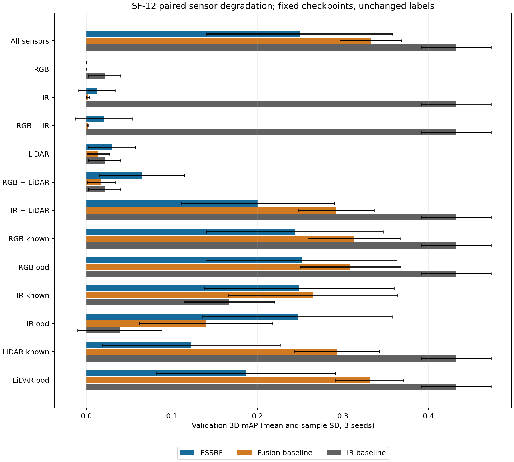
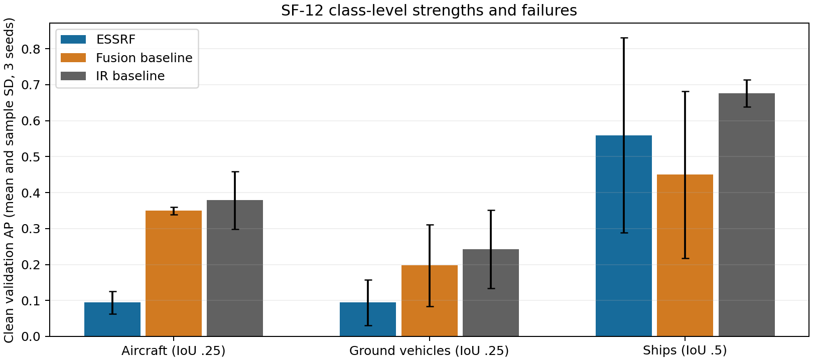
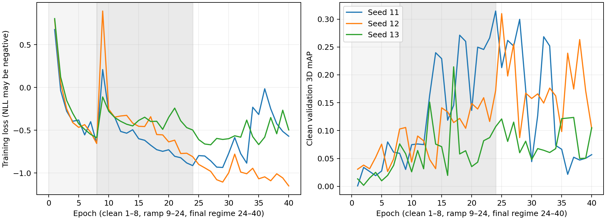

# SF-12 static ESSRF: matched validation experiment

Measured locally on 2026-10-06. This record covers the compact, frame-wise
`essrf-static-v1` profile. Temporal tracking and uncertain calibration remain
outside this experiment. The sealed test split was not evaluated.

## Protocol and implementation

Training uses 2,100 captures; evaluation uses the same 450 grouped validation
captures as SF-11 (nine groups, ten conditions, both sites). Each final model
uses seeds 11, 12 and 13, 40 epochs, batch size 32 and 2,640 optimizer updates.
The dataset manifest SHA-256 is
`00f167a9d263410b783c45f5282a78df8643e28319308a03d891db4521179e3f`.

ESSRF trains the mixture from epoch one: eight clean epochs, then a sixteen-epoch
linear introduction of modality dropout, local corruptions, subset supervision
and reliability losses. The final regime has 70% fully available frames, known
corruption probability .25 and exposure corruption probability .10 per modality.
All eight availability patterns and seven nonempty subset experts are sampled.
Q32, width 128, sixteen local samples, two layers and 8,192 LiDAR points are fixed;
global context is disabled, learning rate is .0005 and computation is FP32.

Checkpoint selection uses clean validation mAP only among epochs 24–40, once
the final training regime is reached. Degradation scores do not select epochs.
The [selection protocol](sf12/selection-protocol.json) fixed the query-choice
criterion before the repaired numerical experiments: equal mean over six
nonempty partial availability cases and six local corruptions. All-missing
abstention is a separate hard requirement; clean mAP is secondary. Q32 was
selected on seed 11 before confirmatory seeds 12/13 were trained; thus the
three-seed aggregate includes one development seed, rather than three unseen
confirmatory seeds. See the [frozen configuration](sf12/selected-configuration.json).

The baselines are the frozen clean-trained SF-11 RGB, IR, LiDAR and fusion models.
Their Q16, width 64, 160×96 images, 256 points and .001 learning rate remain
unchanged. ESSRF uses 640×384 images. The comparison matches data and optimizer
update budgets, **not compute, parameter count or wall time**. Architecture,
preprocessing and augmentation differ together; this does not isolate a causal
architectural improvement.

Each fixed checkpoint evaluates all fourteen paired cases: eight availability
patterns and RGB/IR/LiDAR known and exposure corruptions. Corruption is seeded
from capture ID, scenario and fixed seed 1234, applied to raw arrays before either
model's preprocessing. Disabled sensors lose both data and validity; nominal
calibration stays intact. Camera corruptions occupy the central quarter of image
area (noise or four-pixel stripes). LiDAR corruptions affect the nominal-rig
azimuth wedge [-.2, .2] radians (deletion or ±10 m coordinate jitter).
The `ood` label denotes a training exposure family, **not an unseen corruption
family**. Neither weather severity nor truth visibility enters inference.

Targets retain their original geometric eligibility in every case. In particular,
turning sensors off does not remove difficult objects from the metric. The common
decoder requires probability at least .05 and a global class argmax other than
no-object. Class AP uses 3D IoU .25 for aircraft and ground vehicles, .5 for ships;
mAP is their equal mean. Reported uncertainty is sample SD across three training
seeds, not a confidence interval over correlated validation groups.

## Numerical diagnosis and controls

The original CUDA `grid_sample` backward failed exact repeatability at identical
inputs and weights (maximum gradient difference 1.502e-5) and was rejected by
PyTorch deterministic mode. The replacement `bilinear-v1` sampler preserves
align-corners, zero padding, values and both feature/coordinate gradients within
tested tolerances, and repeats full CUDA forward/backward exactly. Legacy
checkpoints retain their original sampler. Two independent full-data two-epoch
replays also produce identical histories, model tensors and optimizer states;
this is bounded prefix evidence, not a claim that every 40-epoch run was replayed.
See [numerical diagnosis](sf12/legacy-sampling-determinism.json),
[replay evidence](sf12/reproducibility.json) and
[RED/GREEN verification](SF-12-curriculum-tdd.md).

The extra clean Q32 control reached .400 mAP, versus .288 for clean Q16 and .048
for clean Q128 (seed 11, 40 epochs, original sampler). This supports testing query
count; it does not establish that fewer queries are always better. Under the same
repaired sampler and curriculum, Q32 reached clean .314 and degradation macro
.177, versus .118 and .062 for Q16. Original and repaired trajectories must not
be pooled as a single repeatable experiment. The [control ledger](sf12/controls.json)
retains the original controls, attempts and both successful and failed pilots.

## Final measured results

The curriculum does **not** establish an overall robustness advantage. Selected
clean mAP is **.249 ± .109**, versus fusion **.332 ± .036** and IR **.432 ± .041**.
The predeclared twelve-case degradation macro is **.136 ± .064**, versus fusion
**.165 ± .030** and IR **.275 ± .030**. The per-seed ESSRF macros are .177, .168
and .062. The seed-11 improvement over fusion did not generalize to seed 13.

| Scenario | ESSRF | Fusion | IR |
| --- | ---: | ---: | ---: |
| All sensors, clean | .249 ± .109 | .332 ± .036 | .432 ± .041 |
| IR noise | .249 ± .111 | .266 ± .099 | .167 ± .053 |
| IR stripes (exposure family) | .247 ± .111 | .140 ± .078 | .039 ± .049 |
| IR only | .012 ± .021 | .002 ± .002 | .432 ± .041 |
| IR + LiDAR | .201 ± .090 | .292 ± .044 | .432 ± .041 |
| LiDAR deletion | .122 ± .104 | .293 ± .050 | .432 ± .041 |

The IR-stripe advantage over IR holds in all three seeds; against fusion it holds
in seeds 11/12 and reverses in seed 13 (.119 versus .201). The IR-noise advantage
over IR also reverses in seed 13. These are limited, exposure-specific gains,
not proof of general sensor robustness. The [complete matrix](sf12/matrix.md)
includes every case; [full comparison](sf12/comparison.json) preserves RGB/LiDAR
baselines, per-condition/class AP, false positives, calibration, localization,
routing and ungated expert scores. [Summary JSON](sf12/summary.json) includes
paired differences and every seed.

All-missing ESSRF produces **zero detections in every seed**, as required. The
fusion baseline instead produces 820, 930 and 1,510 false positives. Its small
nonzero all-missing mAP reflects accidental matches, not useful perception.
However, surviving single-sensor performance is weak: RGB-only ESSRF mAP is zero,
IR-only .012 and LiDAR-only .030. Ungated corresponding experts also remain weak
(RGB .0003–.0041, IR .0006–.0253, LiDAR .0094–.0487), so null routing alone cannot
explain this failure.

Clean class AP shows another limit:

| Class / IoU | ESSRF | Fusion | IR |
| --- | ---: | ---: | ---: |
| Aircraft / .25 | .094 ± .031 | .350 ± .011 | .379 ± .080 |
| Ground vehicles / .25 | .094 ± .063 | .198 ± .114 | .243 ± .109 |
| Ships / .5 | .560 ± .271 | .450 ± .232 | .676 ± .038 |

ESSRF's clean score is driven mainly by ships; aircraft and ground vehicles remain
poor. Detection calibration is also weak (clean ECE .412, .332, .385). The
evidential parameterization does not ensure successful ignorance detection:
RGB exposure-vacuity AUROC is .378/.427/.424, IR .742/.282/.075 and LiDAR
.569/.585/.578. IR's seed-dependent reversal is a failure, not calibrated
uncertainty. Exact label masks, known/exposure construction, bins, counts and
condition summaries are retained in the comparison JSON.

## Late training failure and bounded diagnosis

| Seed | Selected epoch | Selected clean mAP | Epoch-40 clean mAP |
| --- | ---: | ---: | ---: |
| 11 | 24 | .314 | .057 |
| 12 | 25 | .310 | .104 |
| 13 | 37 | .124 | .105 |

The original explanation that all curves simply need more epochs no longer fits
this curriculum. A retained fixed-epoch-40 seed-11 evaluation drops degradation
macro from .177 to **.040** as well as clean mAP from .314 to .057. This is not
evidence of a clean-versus-robust tradeoff. The original last checkpoint is
evaluated directly; it never replaces the predeclared selection rule. See
[epoch-40 diagnostic](sf12/seed-11-last-comparison.json).

The sampler nonrepeatability and AUROC tie bug were reproduced and repaired with
RED/GREEN tests. The remaining generalization, expert and calibration weaknesses
are measured failures whose causes are not yet isolated. A thirty-frame
[query-support diagnostic](sf12/query-support-diagnostic.json) does not support a
blanket claim that every weak expert samples outside the camera frustum; neither
this sample nor ungated scores establish a single architectural root cause.

The next controlled diagnosis should compare clean Q32 and curriculum Q32 under
the same deterministic sampler across seeds, then ablate subset and reliability
loss ramps separately while recording class/expert gradients and localization
errors. Increasing epochs or modifying support targets without those controls
would confound the evidence. Evaluation labels should stay unchanged. The
current recipe is a documented research configuration, not a robustness winner.

## Resource cost and acceptance

ESSRF has 3,190,188 parameters, versus 172,972 for fusion. Peak allocated training
memory is **7.902 GiB**, reserved **9.188 GiB**, below the 18 GiB limit. Forty-epoch
ESSRF elapsed times are 861/1,025/1,007 seconds. Original baseline seed-11 timing
uses an older reference loop, while later baselines use CUDA graphs; these
[training runtimes](sf12/baseline-runtime.json) are retained but are not a matched
execution-speed experiment.

The same RTX 3090 / PyTorch 2.13.0+cu130 batch-one benchmark measures thirty
validation captures after five warmups, with two CPU threads and a warm
filesystem. It includes raw observation read/validation, profile preprocessing,
host/device transfer, forward computation and prediction decoding; it excludes
checkpoint loading and capture generation.

| Model | End-to-end p50 / p95 (ms) | Forward p50 / p95 (ms) | Peak allocated inference GiB |
| --- | ---: | ---: | ---: |
| Fusion | 111.8 / 154.4 | 4.1 / 5.8 | .033 |
| IR | 22.9 / 28.5 | 2.9 / 4.8 | .032 |
| ESSRF | 52.8 / 63.8 | 31.9 / 39.0 | .070 |

ESSRF's model forward is substantially slower; its faster end-to-end result
relative to fusion reflects the whole profile, including different preprocessing.
These thirty warm-filesystem samples are hardware-scoped, not deployment or
cold-start guarantees. [Full phase/resource measurements](sf12/inference-resources.json)
provide hashes, configurations, capture IDs and reserved memory.

SF-12's static comparison gate is complete, with failures explicitly retained.
Acceptance requires measured comparisons and honest failures, rather than a
clean-data victory. **201 backend tests pass**, and `npm run verify` passes the
local contract, TypeScript, sensor/world/asset, locked backend and build checks.
The selected deterministic Q32 model reaches **1.000 tiny overfit mAP** after
600 updates. This train-only seven-frame check verifies capacity, not
generalization. [Acceptance checks](sf12/acceptance-checks.json) confirm all three
checkpoint hashes/configurations, 2,640 updates, all sampled patterns/subsets,
memory limits and zero all-missing detections. The
[artifact manifest](sf12/artifact-manifest.json) hashes the published evidence.
Temporal ESSRF remains future work.
