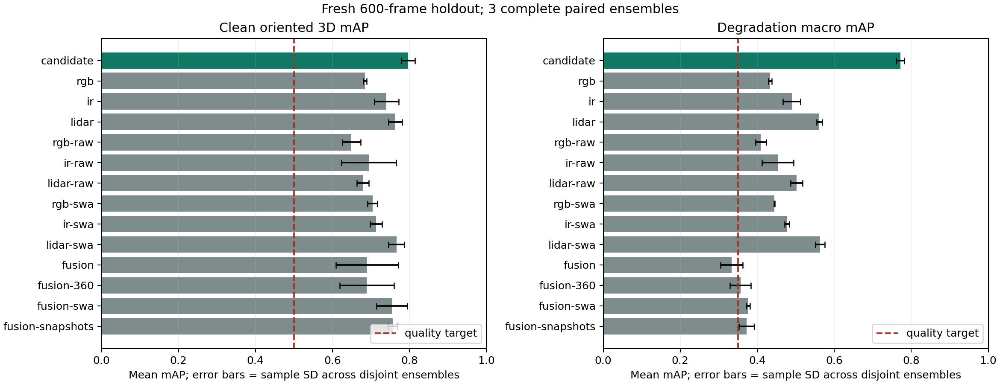

# SF-Q static quality acceptance ? 2026-10-09

**Accepted:** the frozen independent-expert initialization ensemble exceeds both
stretch quality targets, both SD limits, and every declared control mean on the
fresh 600-capture holdout. ESSRF remains a retained negative experiment.
Implementation checkpoint: `04f7474`; a subsequent evidence commit publishes
this report and the hash-checked bundle CLI. No hosted workflow was run.

## Results and comparison

| Method | Clean oriented 3D mAP, mean ? sample SD | Degradation macro, mean ? sample SD |
| --- | --- | --- |
| candidate | 0.7967 ? 0.0180 | 0.7713 ? 0.0104 |
| rgb | 0.6838 ? 0.0044 | 0.4333 ? 0.0046 |
| ir | 0.7403 ? 0.0320 | 0.4895 ? 0.0229 |
| lidar | 0.7633 ? 0.0177 | 0.5612 ? 0.0070 |
| rgb-raw | 0.6491 ? 0.0240 | 0.4092 ? 0.0137 |
| ir-raw | 0.6945 ? 0.0707 | 0.4534 ? 0.0414 |
| lidar-raw | 0.6784 ? 0.0155 | 0.5022 ? 0.0153 |
| rgb-swa | 0.7039 ? 0.0126 | 0.4445 ? 0.0016 |
| ir-swa | 0.7129 ? 0.0158 | 0.4769 ? 0.0063 |
| lidar-swa | 0.7659 ? 0.0203 | 0.5632 ? 0.0119 |
| fusion | 0.6897 ? 0.0813 | 0.3334 ? 0.0285 |
| fusion-360 | 0.6891 ? 0.0704 | 0.3562 ? 0.0272 |
| fusion-swa | 0.7543 ? 0.0396 | 0.3762 ? 0.0054 |
| fusion-snapshots | 0.7565 ? 0.0121 | 0.3726 ? 0.0199 |

Validation candidate: .7119 ? .0037 clean; .6498 ? .0057 macro. Fresh test:
**.7967 ? .0180 clean; .7713 ? .0104 macro**. Strongest control in both metrics is
three-initialization averaged LiDAR: .7659/.5632. Paired improvements over it are
+.0308 clean and +.2080 macro. All targets were fixed before fresh test scoring;
no checkpoint, overlap threshold, weighting or score filtering changed afterward.



All methods retain all nine contiguous training seeds. The **three independent
model replicates are disjoint ensembles**: (11,12,13), (14,15,16), (17,18,19).
SD uses ddof=1 across these three ensembles. This establishes stability for the
deployed ensemble recipe; it does not establish single-initialization SD < .03,
or a confidence interval over sampled layouts. Each unimodal committee and each
feature-fusion committee uses the same member seeds as its paired candidate.
The 360-epoch feature-fusion committee matches the candidate's 1080 total
training epochs/update budget. Network count and computation differ explicitly.

The unchanged evaluator uses upright oriented 3D IoU thresholds .25 aircraft,
.25 ground vehicle and .50 ship. The degradation macro equally averages six
nonempty sensor subsets and six raw-observation corruption cases. Clean/all-
missing are excluded from that macro. All missing gives exactly zero detections.
No truth, annotations, weather, layout seed, or ideal sensor references are inputs.

Fresh clean per-class mean AP/recall: aircraft .9139/.9537 (410 positives),
ground vehicles .6402/.8317 (200), ships .8361/.9156 (300). Mean matched-center
error is 3.90 m; 10-bin detection ECE .1107. The unfiltered outputs still have
720 false positives per 600 captures on average, including 107.7 on 70 empty
captures. Accuracy targets pass; these residual errors remain visible in every
published report, and no test-selected score cutoff hides them.

## Recipe and data integrity

Each sensor expert retains `baseline-v1`: width 64, 16 queries, two decoder layers,
fixed `baseline-preprocess.v1`, 256 observed LiDAR points and 160x96 images.
AdamW lr=.001, weight decay=.0001, clipping 1, batch 32, constant schedule 120 epochs.
For each initialization/sensor, combine the highest clean-validation raw snapshot
(ties latest) and the uniform parameter average over end-of-epoch states 61?120.
Then combine three initialization predictions per sensor, then available sensors.
All consensus stages use fixed IoU .1, uniform weights, class-consistent clusters,
pi-periodic yaw, and at most16 outputs. Availability gates exclude missing inputs.
There are nine training trajectories and **18 inference networks** per ensemble.

Training stays on the original 2100 captures, with 450 validation captures. The
fresh test contains 600 captures/12 entirely new layout groups and zero original
group overlap. Raw capture resolution/beams stay 640x384 and 32x256. It was generated
and independently validated before scoring; generation took 343.44 s, 1.747 captures/s,
5,120,218,713 bytes. It adds evaluation diversity, not extra training examples.

- Training manifest SHA256: `00f167a9d263410b783c45f5282a78df8643e28319308a03d891db4521179e3f`.
- Fresh test manifest SHA256: `9d11f1cbcdb0bb245321cc5f0248c185c75a2c98a13393a5da278cfa2fb814fc`.
- Default ensemble composite SHA256: `fbe84065cbc1fb832ff963f8fb9d4e29911e9b704c7cfadb8dff0947daf17b56`.

The [protocol](sf-quality/ensemble-selection-protocol.json) fixes all groups,
controls, budgets and metrics. The [freeze](sf-quality/ensemble-freeze.json) hashes
all 81 candidate/control checkpoints plus training/inference/evaluation sources.
Sources normalize CRLF to LF; dataset/checkpoint hashes identify exact bytes.
Changed data, checkpoint, source or protocol invalidates the acceptance gate.
The [artifact manifest](sf-quality/artifact-manifest.json) identifies published
bytes, and the [model bundle](sf-quality/model-bundle.json) orders the default 18
checkpoints with individual hashes. Checkpoints/datasets remain local ignored
artifacts, outside normal Git; source and evidence are committed.

## Profiling, resources and verification

Measured Windows/Python3.13.10/PyTorch2.13.0+cu130/RTX3090. An unrelated training
process was preserved throughout; aggregate GPU utilization is not attributable
to this experiment. Features are already device-resident (638,112,000 bytes).
Matched short runs show .339/.396 s graph training+validation per epoch versus
1.853 s eager, with exact evaluation predictions/metrics, loss error 7.45e-9 and
gradient error 1.72e-9. This confirms launch/synchronization overhead and justifies
retaining graph replay/native assignment; it is a short observational comparison
under shared load, not a new isolated sustained speedup claim. Startup is separate.

Training peak allocated memory is 813,129,216 bytes. Summed nine-trajectory
training times are 174/255/254 s for the three groups (startup excluded). The first
group used fewer average validation calls and separate deterministic raw snapshot
runs; those sums are not cross-group speed comparisons. Per-trajectory records
are [published](sf-quality/ensemble-training-resources.json).

Observation file read/hash validation + preprocessing + transfers + 18 eager
heads + consensus: first paired measurement 109 ms median/133 ms p95, 20 samples
after 10 warmups; allocated peak 19.0 MB, reserved 31.5 MB. Bundle reload repeat after
comparison completion measured80.7/87.5 ms, with an unrelated GPU job still active.
A cold one-shot took672 ms plus385 ms model load. The persistent predictor avoids
reloading weights between captures. Values depend on shared load and warmup;
[runtime records](sf-quality/ensemble-inference-runtime.json) retain both context
and model identity, with [bundle repeat](sf-quality/ensemble-bundle-runtime.json).
Live CUDA inference matches saved graph evaluation for `sf11-2100`: classes and
scores agree, max box difference .0001603 m. Hash-checked bundle reload succeeded.

- `python -m pytest backend/tests -q`: **219 passed**, including observation-only
  inference, missing-sensor abstention, seed/snapshot ordering, identities,
  immutable gates, dataset separation and default generator byte parity.
- `npm run verify`: exit0; contracts, TypeScript/world/sensor/assets, backend and
  production build pass (137 backend passed,8 learning skips in the API environment;
  the full learning environment suite above has no skips).
- New/changed Python tools compile; no UI behavior changed, so browser acceptance
  is not claimed for this model-only milestone.

## Reproduce and use

Use the documented [learning environment](../LEARNING_BASELINES.md) and native
CUDA build for training/evaluation. Paths below are repository-relative.
`freeze` refuses to overwrite an existing freeze; fresh test is consumed once.

```powershell
python tools/ensemble-quality.py freeze
python tools/ensemble-quality.py evaluate --split validation
python tools/ensemble-quality.py prepare
python tools/ensemble-quality.py evaluate --split test
python tools/report-quality.py --acceptance artifacts/sf-quality/acceptance-ensemble --dataset artifacts/sf-quality/fresh-holdout/dataset --protocol docs/evidence/sf-quality/ensemble-selection-protocol.json
python tools/infer-decision-fusion.py --bundle docs/evidence/sf-quality/model-bundle.json --observations artifacts/sf11/pilot-3000 --capture-id sf11-2100 --device cuda --output artifacts/sf-quality/prediction.json
```

For a new seed's training trajectory, run each modality rgb/ir/lidar/fusion with
`tools/quality-pilot.py train --model baseline --loss baseline --epochs 120
--constant-lr --swa-start 61 --swa-final --save-raw-best --eval-every 1 --seed SEED
--modality MODALITY --output artifacts/sf-quality/swa-seed-SEED/MODALITY`.
The paired long fusion control uses 360 epochs, constant lr and every-epoch
validation, without averaging. Older raw checkpoints for seeds11?13 come from
`baseline-120[-seed-SEED]/runs`; their histories matched the repeated trajectory.

## Retained failures and limits

Raw consensus failed historical test clean SD (.0456). Averaging alone failed
all-five-seed validation SD (.0347). Two snapshots failed the new confirmatory
seeds 16/17/18 SD (.0482). All are retained; the historical test was not reused for
configuration tuning, and the fresh test was not scored for rejected recipes.
Balanced-loss/dropout/wider-query experiments also remain unpromoted.

This acceptance covers static synthetic three-class detection on new layouts
from the existing generator/asset family and the declared exposed corruption
probes. It does not establish held-out-asset, real-world, novel-corruption,
calibration-drift or temporal performance. The heavier ensemble is deliberate;
compression and temporal/API/UI integration are separate future work.
